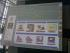

<!DOCTYPE HTML PUBLIC "-//IETF//DTD HTML 3.2//EN">
<META Name="description" Content="The June, 1998 meeting of the Tokyo Linux Users Gro
up">
<META http-equiv="Pragma" Content="no-cache">
<HTML>
<HEAD><TITLE>The June Meeting
</TITLE>
<!-- Changed by: Jim Schweizer, 21-June-1998 -->

</HEAD>
<BODY BGCOLOR=white BACKGROUND="../back2.gif">

                

<TABLE BORDER=0 CELLSPACING=3 CELLPADDING=5><TR><TD VALIGN=top>

<a href="javascript:newWin = window.open ('slideshow.html','byeWin','height=650,width=800,scrollbars=yes');var nothing;">Slide Show.</a>
 (Netscape)

</TD><TD>
&nbsp;



<TABLE WIDTH=85% BORDER=0 CELLPADDING=5 CELLSPACING=2 BACKGROUND="../back3.jpg">
<TR><TD><B>Meeting Topic: </B>

A talk on the Debian and RPM packaging systems for Linux was given
by Stephen Turnbull and Scott Stone.  Packaging systems allow easy 
installation and removal of Linux system software.  The packaging systems
come with powerful dependencies that inform the user what other
programs are needed to ensure a functional Linux system.  For example,
the installation of the Japanese to English dicitionary xjdic is 
dependent on edict and kanjidic.  An attempt to install xjdic
with these packaging systems will result in a search of your system
for edict and kanjidic.  If the programs are not installed, the packaging
system will tell you or install them for you over the Internet or from 
CD.  The packaging systems allow the Linux user to find out information
on every program on their system, learn the contents of software packages
before installation, and find out what files were installed by what packages.
Both rpm and dpkg come with a command line interface and a menu based 
interface.

How these packaging systems can be used for development of .rpm or
.deb packages was also covered.
</TD></TR></TABLE>

<U>About the Speakers</U>

<B>Stephen Turnbull</B>

Mr. Turnbull spoke on the Debian packaging system.  He is a long time
Linux user and an early member of TLUG.  Mr. Turnbull contributes to 
the development of XEmacs, is the maintainer of the elisp Japanese to 
English dictionary interface to edict, edict.el, and is one of the
principal authors for an upcoming book on Japanese support of Linux
to be published by O'Reilly Japan.  Mr. Turnbull holds a doctorate
in economics from Stanford University and is a professor at Tsukuba
University in Japan when he is not hacking Linux.

His presentation covered these areas:

<OL>
<LI>  Package management
  <OL type=a>
    <LI>  A fancier `tar'
    <LI>  Distributions, dependencies, policies, and packages
  </OL>
<LI>  User tools
  <OL type=a>
    <LI>  Package selection database: dselect
    <LI>  Package management (query, install, configure, remove): dpkg, alien
  </OL>
<LI>  Developer tools
  <OL type=a>
    <LI>  Anatomy of a package
    <LI>  Building: dpkg-deb
    <LI>  Packaging: dkpg-deb
  </OL>
<LI>  Building packages
  <OL type=a>
    <LI>  Hello
    <LI>  Custom Linux kernel
    <LI>  XEmacs 21
    <LI>  How should the XEmacs 21 package system coexist with Debian's?
  </OL>
</OL>

<B>Scott Stone</B>

Mr. Stone spoke on the RPM packaging system, a topic he is intimate
with through years of experience.  Mr. Stone is the primary developer
of Pacific HiTech's TurboLinux and TurboLinux-J which uses the RPM 
packaging system for all its programs.  Mr. Stone is an active TLUG
member, is the primary system administrator for the TLUG server, and
is an active contributor to the free software movement.  The
TurboLinux-J Linux distribution that Mr. Stone developed is the only
commercially developed and supported Japanese Linux distribution. 
Additional information on TurboLinux can be found on the web at
<A HREF="http://www.pht.co.jp">http://www.pht.co.jp</A>.  Mr. Stone studied computer science at 
the University of Utah. 

His presentation covered RPMs, specifically:

<UL>
<LI>Basic usage of the commandline tool
  <UL>  
  <LI type=circle> installing
  <LI type=circle> uninstalling
  <LI type=circle> upgrading
  <LI type=circle> querying
    <UL>                     
    <LI type=square> information
    <LI type=square> file listings
    <LI type=square> checking rpm ownership of files
    <LI type=square> install/uninstall script listings
    <LI type=square> Advanced header data retrieval
      <UL>
      <LI type=disc> file permissions
      <LI type=disc> copyright info
      <LI type=disc> etc...
      </UL>
    </UL>
  </UL>
<LI>Capabilities of the package management system
  <UL>
  <LI type=circle> How it handles dependencies/conflicts
  <LI type=circle> Version / Release numbering
  <LI type=circle> Signatures
  <LI type=circle> Etc..
    <UL>
    <LI type=square> Building RPMs
    <LI type=square> .spec file format
    <LI type=square> architecture considerations
    <LI type=square> Creating dependency lists
    <LI type=square> Signing packages w/ PGP
    <LI type=square> Rebuilding .(arch).rpm from .src.rpm
    </UL>
  </UL>
</UL>

<U>Raffle</U>

Some people won fabulous prizes.  Voluntary donations of
approximately 500 yen during the meeting were solicited.  If you make a donation,
it helps the awesome goals of TLUG.  Free software remains free
because of you.  Also, you get a chance to win some great prizes.

3 UPS's 
3 486's 
5 monitors 
Keyboards 
A lot of power blocks  
3 Hubs 
switch boxes 
lots of ethernet cables, connectors, etc.

Finance information can be found in the <A HREF="../../acct/index.html"> accounting section</A>
of the TLUG home page.

</TD></TR></TABLE>

