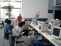
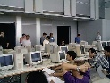
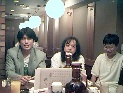
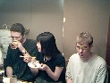
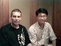

<!DOCTYPE HTML PUBLIC "-//IETF//DTD HTML 3.2//EN">
<META Name="description" Content="The August, 1998 meeting of the Tokyo Linux Users Gro
up">
<META http-equiv="Pragma" Content="no-cache">
<HTML>
<HEAD><TITLE>The August Meeting
</TITLE>
<!-- Changed by: Tim Meggs, 11-August-1998 -->
<!-- Changed by: Tim Meggs, 20-August-1998 -->

</HEAD>
<BODY BGCOLOR=white BACKGROUND="../back2.gif">

                

<TABLE BORDER=0 CELLSPACING=3 CELLPADDING=5><TR><TD VALIGN=top>

Meeting and 
Nomikai picts.

<A HREF="980808a.jpg">

<A HREF="980808b.jpg">

<A HREF="980808c.jpg">

<A HREF="980808d.jpg">

<A HREF="980808e.jpg">

</TD><TD>
&nbsp;



We also voted to purchase a CD-ROM RW burner from Marcus Metzler, who in 
addition, provided images for Debian 2 which we hope to clone for the next 
nomikai.    The CDRom burner is now available to anyone for use in providing 
the group with software distributions ... CD to burn? call Jonathan Byrne :-)

Special thanks to Gaspar Sinai for the loan of his Dec Alpha, Takeshi
Hakamada for bringing the SGI Indy, Chris Sekiya for the Amiga 3000 and 
Tim Meggs for bringing the Mac "boilermaker".  Thanks also to Shigeo Honda 
for again organizing the food and beverages, and Jonathan Byrne for 
organizing the library.

Best surprise of the meeting:  Jonathan's 5000 yen Sparc 2, labeled as
defective at the store, booted as soon as memory was added!

In addition there were free-take-as-many-as-you-can-carry 10baseT ethernet 
cables, power cables, UK power cables(!!), brass screws(!?!?) and other 
odds and ends at the door for all.

The Tengu nijikai was a gathering of minds, mostly in a foggy state, and
was a lot of fun.  What was in those shooters, Tim? :-)

</TD></TR></TABLE>
Japanese notes are available at <A HREF="./index-j.html">http://tlug.jp/9808/index-j.html</A>

Finance information can be found in the <A HREF="../../acct/index.html"> accounting section</A>
of the TLUG home page.

</TD></TR></TABLE>

