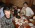

<!DOCTYPE HTML PUBLIC "-//IETF//DTD HTML 4.0 Draft//EN">
<HTML>
<HEAD><TITLE>The September Nomikai
</TITLE>
<!-- Changed by: Jim Schweizer, 20-September-1998 -->
<META http-equiv="Pragma" Content="no-cache">
<META Name="description" Content="The August, 1998 meeting of the Tokyo Linux Users Gro
up">
<META HTTP-EQUIV="Content-Type" CONTENT="text/html; CHARSET=iso-8859-1">
<META HTTP-EQUIV="Content-language" CONTENT="en-US">
<META NAME="Author" CONTENT="Jim Schweizer">
<META NAME="rating" CONTENT="General">
<META NAME="ROBOTS" CONTENT="ALL">

</HEAD>
<BODY BGCOLOR=white BACKGROUND="../back2.gif">

                

                

<TABLE BORDER=0 CELLSPACING=3 CELLPADDING=5><TR><TD VALIGN=top>

Nomikai picts.

<A HREF="pdrm0005.jpg">

<A HREF="pdrm0006.jpg">

<A HREF="pdrm0007.jpg">

<A HREF="pdrm0008.jpg">

<A HREF="pdrm0009.jpg">

<A HREF="pdrm0010.jpg">

<A HREF="pdrm0012.jpg">

<A HREF="pdrm0013.jpg">

<A HREF="pdrm0014.jpg">

<A HREF="pdrm0015.jpg">

<A HREF="pdrm0016.jpg">

<A HREF="pdrm0017.jpg">

</TD><TD VALIGN=top>
&nbsp;

<TABLE WIDTH=85% BORDER=0 CELLPADDING=3 CELLSPACING=2>
<TR><TD COLSPAN=3 ALIGN=center VALIGN=top>
<U>September Nomikai Information</U></TD></TR>
</TABLE>

<TABLE WIDTH=85% BORDER=0 CELLPADDING=5 CELLSPACING=2 BACKGROUND="../back3.jpg">
<TR><TD><B>Date</B>:</TD><TD> September 188, 1998</TD></TR>
<TR><TD><B>Nomikai Meeting Place</B>:</TD><TD>Tengu Tokyo EkiMae</TD></TR>
<TR><TD><B>Nomikai Time</B>:</TD><TD> 19:30</TD>
</TR>
<TR><TD VALIGN=top><B>Nomikai Place</B>:</TD><TD> 
Tengu Tokyo EkiMae, 
Kyobashi 1-1-6, EchiZenYa Bld. B1/B2,  
Chuo-ku, Tokyo 
Phone: 03-3275-3691 
</TD></TR></TABLE>

<TABLE WIDTH=85% BORDER=0 CELLPADDING=5 CELLSPACING=2 BACKGROUND="../back3.jpg">
<TR><TD>

The Friday Nomikai at Tengu was another success, and 24 people came out 
to eat, drink, and talk linux :-)
   

We had a "mini-auction" of DRAM donated by <B>Urs Roesch</B>, and some network
cards as well.  That plus a donation from <B>Hikaru</B> and the change from the
Nomikai gives us over 16,000 yen to go towards the Tlug library and other
good tlug events. 

Also, thanks to <B>Cliff Miller</B> and <B>Scott Stone</B> of PHT for donating copies of
Applixware-J and Turbolinux 2.0E, and to <B>Marcus Metzler</B> for donating 4
O'Reilly books plus over 30 movies to the library.  The Voyager and Deep
Space Nine CD's were especially popular.
   

Now that we have some funds to put into materials, please contact 
<A HREF="mailto:jonathan@tlug.jp">Jonathan
Byrne</A> or talk to him at the next meeting about what software or books you
would like to see in the library.
    

Thanks again to everyone who came out and helped celebrate!

-Joe Marchak

</TD></TR></TABLE>

Finance information can be found in the <A HREF="../../acct/index.html"> accounting section</A>
of the TLUG home page.

</TD></TR></TABLE>

 or talk to him at the next meeting about what software or books you
would like to see in the library.
    

Thanks again to everyone who came out and helped celebrate!

-Joe Marchak

</TD></TR></TABLE>

Finance information can be found in the <A HREF="../../acct/index.html"> accounting section</A>
of the TLUG home page.

</TD></TR></TABLE>

