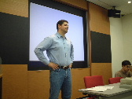

<table>
<tr><td>&nbsp;<b><a href="../../index.html">tlug.gr.jp</a></b>&nbsp;&nbsp;
&gt;&gt;&nbsp;<a href="../../meeting.html">The Next Meeting</a>&nbsp;&nbsp;
&gt;&gt;&nbsp;<a href="../index.html">Previous Meetings</a>&nbsp;&nbsp;
&gt;&gt;&nbsp;May 2002 Meeting
</td></tr>
</table>

 
 

<table border=0 width="70%">
<tr>
<td colspan=2>
<h2>
Tokyo Linux Users Group

Technical Meeting
</h2>
</td>
</tr>
<tr>
<td><b>Date</b></td>
<td>Saturday, May 11th, 2002 </td>
</tr>
<tr>
<td bgcolor=silver><b>Time</b></td>
<td>13:30 - 17:00</td>
</tr>
<tr>
<td bgcolor=silver><b>Events</b></td>
<td>
	1. Linux Terminal Server and Diskless Clinets 
	2. Kickstart - Automating Linux Installs 
	3. Auction 
	4. Questions and Answers + News and Announcements</td>
</tr>
<tr>
<td bgcolor=silver><b>Place</b></td>
<td>Leading Edge Co. Seminar Room 
	Once again our special thanks go to <a href="http://www.leadinge.co.jp/">
	Leading Edge Co., Ltd.</a>
	for letting us use their seminar room. Leading Edge offers IT consulting 
	and IT placement services.</td>
</tr>
</table>

 
 
<table border=0 cols=2 width="90%">
<tr>
<td>
<h3><b>Introduction</b></h3>
As usual, we started the meeting with a brief introduction.  We had 15 new members this time, each of whom introduced themselves to the group. Welcome to TLUG!   
Following the introduction, we made a couple of announcements: 
<li>Listmaster/Web development contributors wanted</li>
<li>TLUG server relocation</li>
&nbsp;&nbsp;(The colocation plan is being negotiated between TLUG and <a href="http://www.osdl.jp/">OSDL</a>)
  
It was at this time that we took a quick poll of what the participants' Linux environment was like.  The results are below:

<!-- poll begin -->

<table border=0 width="80%">
<tr>
<td bgcolor=silver>
	<table width="100%">
	<tr><td colspan=2><b>Your Distribution</b></td></tr>
	<tr><td bgcolor=white>RedHat</td>
	<td bgcolor=white align=right>10</td>
	<tr><td bgcolor=white>Caldera</td>
	<td bgcolor=white align=right>4</td>
	<tr><td bgcolor=white>Mandrake</td>
	<td bgcolor=white align=right>5</td>
	<tr><td bgcolor=white>SuSE</td>
	<td bgcolor=white align=right>2</td>
	<tr><td bgcolor=white>Turbo</td>
	<td bgcolor=white align=right>2</td>
	<tr><td bgcolor=white>Debian</td>
	<td bgcolor=white align=right>4</td>
	<tr><td bgcolor=white>Darwin</td>
	<td bgcolor=white align=right>1</td>
	<tr><td bgcolor=white>FreeBSD</td>
	<td bgcolor=white align=right>4</td>
	<tr><td bgcolor=white>Cygwin</td>
	<td bgcolor=white align=right>4</td>
	<tr><td bgcolor=white>NetBSD/OpenBSD</td>
	<td bgcolor=white align=right>:-)</td>
	</td></tr>
	</table>
</td>
<td>
	<table cols=1><tr><td bgcolor=silver>

	<table width="100%">
	<tr><td colspan=2><b>Your Browser</b></td></tr>
	<tr><td bgcolor=white>Mozilla</td>
	<td bgcolor=white align=right>7</td>
	<tr><td bgcolor=white>Netscape</td>
	<td bgcolor=white align=right>6</td>
	<tr><td bgcolor=white>Opera</td>
	<td bgcolor=white align=right>2</td>
	<tr><td bgcolor=white>Konqueror</td>
	<td bgcolor=white align=right>3</td>
	<tr><td bgcolor=white>Galeon</td>
	<td bgcolor=white align=right>3</td>
	<tr><td bgcolor=white>Lynx</td>
	<td bgcolor=white align=right>2</td>
	</td></tr>
	</table>

	</td></tr>
	<tr><td bgcolor=silver>

	<table width="100%">
	<tr><td colspan=2><b>Your Text Editor</b></td></tr>
	<tr><td bgcolor=white>Vi (includes Vim)</td>
	<td bgcolor=white align=right>14</td>
	<tr><td bgcolor=white>Emacs / Xemacs</td>
	<td bgcolor=white align=right>3</td>
	</td></tr>
	</table>

	</td></tr></table>

</td>
<td>
	<table cols=1><tr><td bgcolor=silver>

	<table width="100%">
	<tr><td colspan=2><b>Your Email Client</b></td></tr>
	<tr><td bgcolor=white>Mutt</td>
	<td bgcolor=white align=right>5</td>
	<tr><td bgcolor=white>Pine</td>
	<td bgcolor=white align=right>2</td>
	<tr><td bgcolor=white>Sylpheed</td>
	<td bgcolor=white align=right>1</td>
	<tr><td bgcolor=white>Wanderlust</td>
	<td bgcolor=white align=right>1</td>
	<tr><td bgcolor=white>Mew</td>
	<td bgcolor=white align=right>2</td>
	</td></tr>
	</table>

	</td></tr>
	<tr><td bgcolor=silver>

	<table width="100%">
	<tr><td colspan=2><b>Your Desktop Environment</b></td></tr>
	<tr><td bgcolor=white>KDE</td>
	<td bgcolor=white align=right>9</td>
	<tr><td bgcolor=white>Gnome</td>
	<td bgcolor=white align=right>many</td>
		<tr><td bgcolor=white>ICEwm</td>
	<td bgcolor=white align=right>2</td>
	</td></tr>
	</table>

	</td></tr></table>
</td>
</tr>
 

</td>
</tr>
</table>
<!-- poll end -->

</td>
</tr>
</table>

<h3><b>What's new & What's cool</b></h3>
From TLUG members who are always looking for cool things to try out....  
Below are a few applicatoions Linux users may want to check out. 
 
<li><a href="http://fluxbox.sourceforge.net/">Fluxbox</a> - a new window manager based on BlackBox code. </li> 
<li><a href="http://multignometerm.sourceforge.net/">Multignome</a> project - An enhanced version of gnome terminal which lets you switch between tabbed termnal windows.</li>
<li><a href="http://www.ethereal.com/">Ethereal</a> - A graphical network analyzer with many filtering features. An essential tool for solving network problems!</li>
 

<h3><b>Presentations</b></h3>

<table border=0>
<tr>
<td>
1. <b>"Linux Terminal Server and Diskless Clients"</b> by Mauro Sauco 
2. <b>"Kickstart - Automating Linux Installs"</b> by Alberto Tomita 
(I'll make the slides available as soon as I work out how :) )
</td></tr>
<tr><td>
	<table><tr><td>
	</td>
	<td></td>
	<td></td>
	<td></td></tr>
	<tr><td></td>
	<td></td>
	<td></td></tr>
	</td></tr></table>
</table>

<h3><b>Auction</b></h3>
TLUG is a non-profit, self-supported organization. In order to cover occasional expenses, we hold auctions to raise funds. The proceeds are saved in the TLUG account and is used for server hardware maintenance, domain name registration, to rent a meeting space when a free venue isn't available, etc.  
As usual, May 2002 TLUG auction was a huge success. Many thanks to Jim Tittsler for running the auction, as well as people who brought in items and people who bid for them.  The stuffed penguins are always very popular.  Here is the summary.   

<table width="80%"><tr><td bgcolor=silver>
	<table width="100%">
	<tr><td><b>Item</b></td>
		<td><b>Category</b></td>
		<td><b>Price</b></td></tr>
	<tr><td bgcolor=white>Internet Yellow Pages</td>
		<td bgcolor=white>Book</td>
		<td bgcolor=white align=right>50</td></tr>
	<tr><td bgcolor=white>Motherboard</td>
		<td bgcolor=white>Hardware</td>
		<td bgcolor=white align=right>1,600</td></tr>
	<tr><td bgcolor=white>Motherboard</td>
		<td bgcolor=white>Hardware</td>
		<td bgcolor=white align=right>1,200</td></tr>
	<tr><td bgcolor=white>Motherboard</td>
		<td bgcolor=white>Hardware</td>
		<td bgcolor=white align=right>500</td></tr>
	<tr><td bgcolor=white>CDROM drive</td>
		<td bgcolor=white>Hardware</td>
		<td bgcolor=white align=right>600</td></tr>
	<tr><td bgcolor=white>SPARC Classic</td>
		<td bgcolor=white>Hardware</td>
		<td bgcolor=white align=right>2,100</td></tr>
	<tr><td bgcolor=white>Mobile Phone Straps</td>
		<td bgcolor=white>Accessory</td>
		<td bgcolor=white align=right>600(*2)</td></tr>
	<tr><td bgcolor=white>LPI Stuffed Penguins</td>
		<td bgcolor=white>Accessory</td>
		<td bgcolor=white align=right>1,900(*2) +100</td></tr>
	<tr><td bgcolor=white>RedHat neck strap</td>
		<td bgcolor=white>Accessory</td>
		<td bgcolor=white align=right>1,000</td></tr>
	<tr><td bgcolor=white>RedHat CDROMs</td>
		<td bgcolor=white>Software</td>
		<td bgcolor=white align=right>1,000</td></tr>
	<tr><td colspan=3 align=right>Total <b>JPY 13,050</b></td></tr>
	</table>
</td></tr></table>

<!-- photos -->

<table><tr><td>
	</td>
	<td></td>
	<td></td>
	</tr>
</table>

<h3><b>Announcements</b></h3>
<table cols=2><tr><td>
<li><a href="http://www.mozilla.gr.jp/party/">Mozilla Party</a> to celebrate the release of version 1.0 will be held Saturday, 18th of May.</li>
<li><a href="http://www.idg.co.jp/expo/lw/">LinuxWorld </a>Invitation tickets were given out, courtesy of <a href="http://www.leadinge.co.jp/">Leading Edge Co., Ltd.</a></li>
</td>
<td></td></tr></table>

<h3><b>Nomikai</b></h3>
After the meeting closed, about 25 of us walked to Shirokiya near Akasaka-Mitsuke Station. 
A few more members joined us at the izakaya. <a href="nomikai.html">Here</a>'s the post-nomikai photo gallery ... enjoy!
 

meeting notes by Ayako Kato (Email me at ayakat@tlug.gr.jp with corrections, comments etc. :)