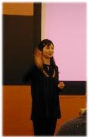

 

<table border="0" cellpadding="3" cellspacing="1" width="70%" /><tr>
		<td /><b>TLUG "nomikai"</b></td></tr>
</table> 

<table border="0" width="70%" cellpadding="1" cellspacing="1" />
	<tr />
		<td width="80" valign="top" /><b>Date</b></td>
		<td>Saturday, January 18th, 2003 </td>
	</tr>
	<tr />
		<td width="80" valign="top" /><b>Time</b></td>
		<td>13:30 (until around 17:00) </td>
	</tr>
	<tr />
		<td width="80" valign="top" /><b>Topics</b></td>
		<td>
			

				<ol>
					<li>Spam Prevention: Attend if you run your own Linux mail server!</li>

					
Jim Tittsler will speak briefly about some of the more recent
					spam detection/prevention/filtering techniques including
					<a href="http://www.SpamAssassin.org/">SpamAssassin</a>  and 
					<a href="http://SpamBayes.SourceForge.net/">SpamBayes</a>
					.

					
[ <a href="http://www.OnJapan.net/notes/spam/" target="_blank">Jim's Note</a> ]

					<li>Election</li>
					
					
					
					
This year, we're looking to elect new president who can
					serve the wonderful Tokyo Linux user community for the year
					2003.

					
					
President's job includes organizing technical meetings,
					(i.e., finding a meeting hall and speakers) set the general
					direction for the group, boss around the other officers (just
					kidding!) and promote the use of linux through technical
					meetings and drinking parties.

					
Election Result:

					
					<table border="0" cellpadding="2" cellspacing="1">
						<tr><td>Position</td><td>2002</td><td>2003</td></tr>
						<tr><td>President (domainname caretaker):</td><td>Ayako Kato</td><td>Mauro Sauco</td></tr>
						<tr><td>Vice Prez:</td><td>Mauro Sauco</td><td>Yoshihiko Baba</td></tr>
						<tr><td>Sysadmin:</td><td>Sajjad Zaidi</td><td>Sajjad Zaidi</td></tr>
						<tr><td>Listmaster:</td><td>Josh Glover</td><td>Josh Glover</td></tr>
						<tr><td>Webmaster:</td><td>Yoshihiko Baba</td><td>Yoshihiko Baba</td></tr>
						<tr><td>Auctioneer:</td><td>Jim Tittsler</td><td>Jim Tittsler</td></tr>
						<tr><td>Tresurer:</td><td>Tim Meggs</td><td>Tim Meggs</td></tr>
						<tr><td>ShadowPresident:</td><td>Alberto Tomita</td><td>Alberto Tomita Ayako Kato</td></tr>
					</table>
					
					<li>Auction</li>
					
					

					Thanks to the illegally parked Ulrich Plate, we had a
					successful auction of the remnants of the Jonathan Byrne Legacy
					Collection.  People donated a total of Y6100 to TLUG.
					

					

					Thanks again to Ulrich for bringing along the items for
					auction... and then auctioning them off.  And to everyone
					for participating and donating to the group.
					

					
					<li>Project at OSDL Japan</li>

					
OSDL (Open Source Development Lab) currently hosts TLUG's server
					free of charge in their Yokohama datacentre, on the condition 
					that TLUG proposes a Linux-based project with them, for which 
					they will provide development environment. This is a great way to 
					contribute to the open source community. 
					

					
If you have any suggestions, please bring them here for us to 
					discuss and participate in. 
					

					
For more information please visit <a href="http://www.osdl.jp/">
					http://www.osdl.jp/</a>
					

					<li>TLUG auction and misc topics</li>

					
(Please see Jim's posting - our auctions are great fun!)

				</ol>

	<tr />
		<td width="80" valign="top" /><b>After the meeting:</b></td>
		<td>We'll continue our meeting over some beer. (Place TBD) </td>
	</tr>
	<tr />
		<td width="80" valign="top" /><b>Contact:</b></td>
		<td>	Mauro ......090-2492-0840 (Keitai) 
	Kato  ......070-5591-7003 (PHS) </td>
	</tr>
		</td>
	</tr>

</table>
 
